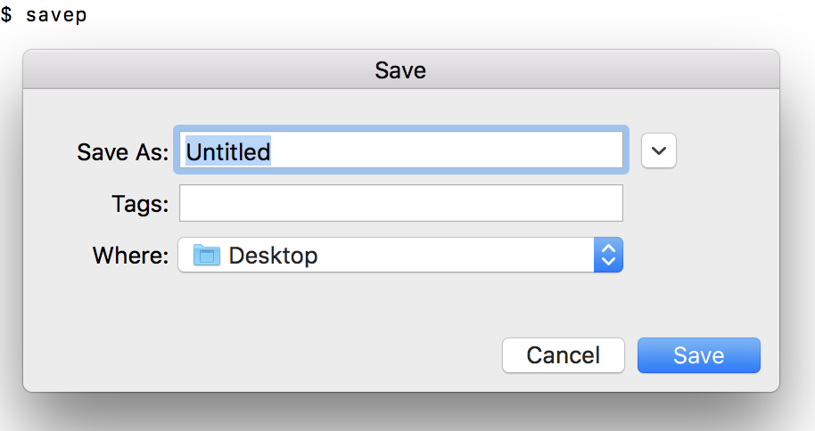

# svep
Just shows save panel GUI to set destination file, which may fulfills interactive selection in script.

# Installation

```
$ brew tap watr/formulae
...
$ brew install savep
```

# Usage

```
$ echo "Hello savep!" >> `savep`
```


